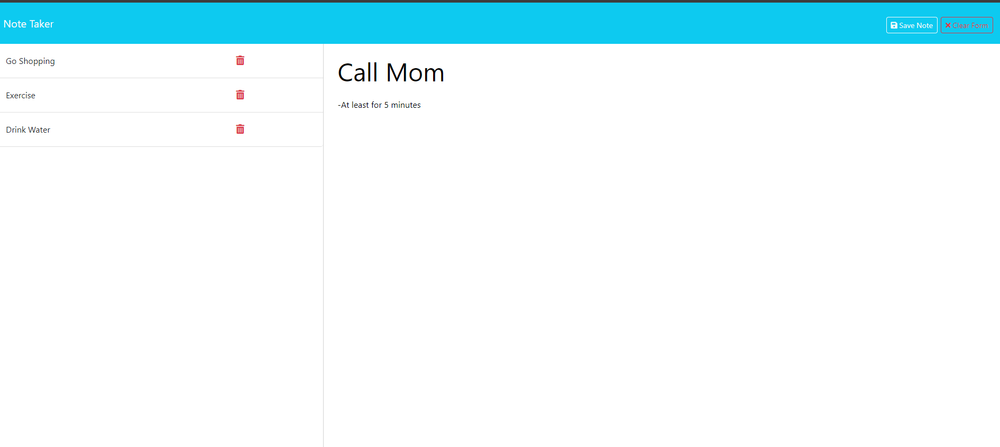

# Note Taker

GitHub Repo: https://github.com/jheersink8/add-my-notes

Deployed Site: https://add-my-notes.onrender.com/ 

## Description

This tool is used for users to make simple notes and have the stored values persist so that they can be opened from other devices. The values are stored on a server using Express.js. This tool demonstrates a working knowledge of the following tools: 

- Node.js
- Express.js
- The get, post, and delete Express.js methods
- Destructors 
- Writing to and reading from JSON files

## Usage
After visiting the deployed website link posted above, the user will be presented with a display of the site's home screen. After clicking "Get Started," they'll be redirected to the Note Taker storage site. Here, they can do the following: 
- Enter new notes into the right side of the screen by clicking on the stand in text "Note Title" and "Note Text"
- Save new notes (which will appear on the left side of the screen)
- Click on old notes to have the "New Note" button appear (and thus create more notes)
- Click the delete button to delete any note

## Credits
- Scenario presented by Denver University in the Bootcamp course ID DU-VIRT-FSF-PT-12-2023-U-LOLC-MWTH under Module 11 Challenge. Starter code (which contained content in "public" folder) was presented by Denver University. All other code was modified and submitted by Jordan R. Heersink.
- This tool uses node.js, and express.js

## License
https://opensource.org/licenses/MIT 

  Copyright (c) {{ 2024 }} {{ Jordan Heersink }}

    Permission is hereby granted, free of charge, to any person obtaining a copy
    of this software and associated documentation files (the "Software"), to deal
    in the Software without restriction, including without limitation the rights
    to use, copy, modify, merge, publish, distribute, sublicense, and/or sell
    copies of the Software, and to permit persons to whom the Software is
    furnished to do so, subject to the following conditions:
    
    The above copyright notice and this permission notice shall be included in all
    copies or substantial portions of the Software.
    
    THE SOFTWARE IS PROVIDED "AS IS", WITHOUT WARRANTY OF ANY KIND,
    EXPRESS OR IMPLIED, INCLUDING BUT NOT LIMITED TO THE WARRANTIES OF
    MERCHANTABILITY, FITNESS FOR A PARTICULAR PURPOSE AND NONINFRINGEMENT.
    IN NO EVENT SHALL THE AUTHORS OR COPYRIGHT HOLDERS BE LIABLE FOR ANY CLAIM,
    DAMAGES OR OTHER LIABILITY, WHETHER IN AN ACTION OF CONTRACT, TORT OR
    OTHERWISE, ARISING FROM, OUT OF OR IN CONNECTION WITH THE SOFTWARE OR THE USE
    OR OTHER DEALINGS IN THE SOFTWARE.